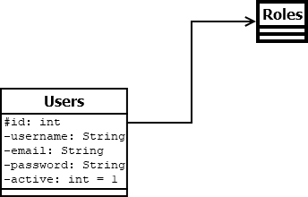

# Trabajo Práctico Cuatrimestral OO2

## UML
#

#
Guardar y Exportar como PNG en la Raiz del Proyecto Diagrama_OO2_TPC_Grupo6.png
#
## Instalación

```
git clone https://github.com/iFeddy/Grupo-6-OO2-2021.git
```
#
### Instalar la base de datos

Crear una base de datos que se llame:
```
oo2tpc
```
Crear un usuario de MySQL con privilegios globales con los siguientes datos:

```
Usuario: oo2tpc
Contraseña: oo2tpc
```

#

## Sessiones
Para ver las Sessiones en los metodos donde se necesite, hay que agregarle (HttpSession session) y el metodo para traer la info de la sesion es session.getAttribute("KEY");

### Session de Usuario
Key: [USER] - Clase User

#

## Helpers

### AuthHelper
Este es un middleware para determinar si el usuario puede o no puede ingresar al sistema segun el area, aca se pondria tambien los roles del usuario. Por el momento si Inicio Sesion, lo deja pasar al admin/*.
En el ultimo return de los ModelAndView de Mapeo GET reemplazar el return view; por este codigo:

```
AuthHelper authHelper = new AuthHelper(session);
return authHelper.AuthMiddleware(view);
```
#
### ConfigHelper
Configuraciones Globales como el nombre de la app, permisos, db, etc
#
### RouteHelper
Para no tener que andar cambiando las rutas desde los metodos, las propiedades tienen que ser static String, despues en los metodos de los controladores lo llamamos asi:

```
ModelAndView view = new ModelAndView(RouteHelper.INDEX);
```
#
### AdminSideBarHelper
Para agregar los links del menu lateral en Admin, hay que instanciar un nuevo AdminSideBar con el ID que le corresponda

```
AdminSideBar[] links = {
            ....
            new AdminSideBar(int, "url", "class icon de fontawesome", "texto del link"),
        };      
```
#
## Actualizar Dependencias Front-end
No creo que sea necesario usar esto pero si hay que actualizar jQuery/Bootstrap etc... hay que usar npm y copiar el dist dentro de static (esta mal pero funciona)

```
npm update
```

#
## Panel de Administración

No creo que tengamos la necesidad de usar charts pero igual dejo el link del template por si necesitamos agregar algo de ahi:

Template: https://wrappixel.com/demos/admin-templates/ampleadmin/ample-admin-lite/dashboard.html

Si llegamos a necesitar Tablas podemos usar DataTables.js que funciona con jQuery

#
## Dependencias Front-end

- Para iconos: https://fontawesome.com/
- Para Bootstrap: https://getbootstrap.com/docs/4.4/getting-started/introduction/
- Para jQuery: https://api.jquery.com/


## Primera Entrega

Faltan los perfiles (Roles) hay que hacer la relacion y tabla en db
Falta hacer el diagrama de clases (DIA)
1 usuario 1 perfil

Roles
1 Usuario
2 Admin (Puede Verificar todo)
3 Auditoria (Puede descargar datos en PDF????)

ABM Usuarios

## Segunda Entrega
(Front) Pagina de Registro de usuario
(Front) Pedir Permiso sin estar registrado (nro dni)
(Front) Alta de Rodados
(Front) Traer Permiso por Persona
(Admin) Traer Permiso por Rodado
(Admin) Traer Permisos Activos entre Fecha y Fecha
(Admin) Traer permisos Activos entre Fecha y Fecha que salgan / lleguen a un lugar determinado

## Tercera Entrega
Código QR para que muestre la info del permiso