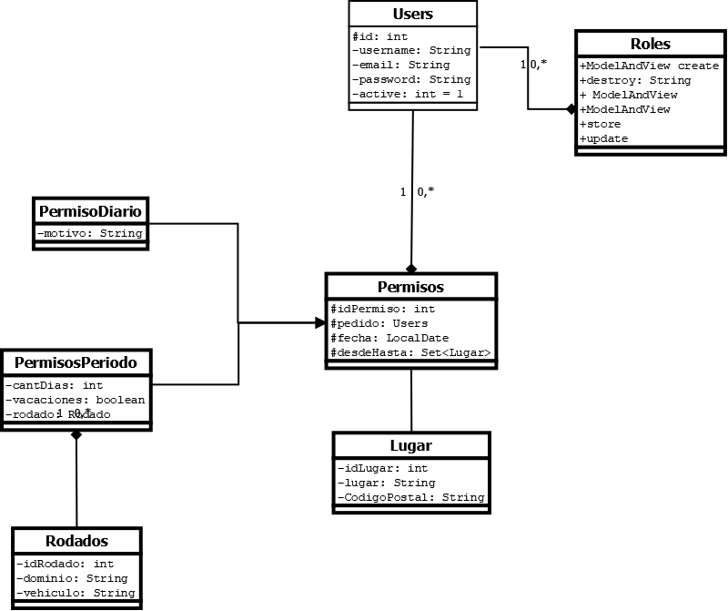

# Trabajo Práctico Cuatrimestral OO2

## UML
#

#
Guardar y Exportar como PNG en la Raiz del Proyecto Diagrama_OO2_TPC_Grupo6.png
#
## Instalación

```
git clone https://github.com/iFeddy/Grupo-6-OO2-2021.git
```
#
### Instalar la base de datos

Crear una base de datos que se llame:
```
oo2tpc
```
Crear un usuario de MySQL con privilegios globales con los siguientes datos:

```
Usuario: oo2tpc
Contraseña: oo2tpc
```

La carga de datos iniciales esta en modo automatico en el archivo [src/main/resources/data.sql](src/main/resources/data.sql)

#
## NGROK

Para configurar NGROK y probar los codigos QR desde los telefonos, hay que correr el proyecto de JAVA SPRING y despues en otra consola ejecutar en la raiz del proyecto:

```
.\ngrok.exe http 8080
```
Se va a abrir un tunel online desde una url a nuestra pc. 


Entrar con el link https que nos da NGROK en el navegador para poder entrar desde cualquier dispositivo.

#
## Usuarios Predeterminados Para el Administrador
#
### Usuario (Acceso Restringido)
usuario@usuario.com : 1234
#
### Auditor (Acceso Intermedio)
auditor@auditor.com : 1234
#
### Administrador (Acceso Total)
admin@admin.com : 1234
#
## Sessiones
Para ver las Sessiones en los metodos donde se necesite, hay que agregarle (HttpSession session) y el metodo para traer la info de la sesion es session.getAttribute("KEY");

### Session de Usuario
Key: [USER] - Clase User

## Permisos por DNI de prueba
#
### Natalia Perez DNI 1000000
### Juan Ramirez DNI 10000000
### Julian Sanchez DNI 99999999
### Monica Montalvo DNI 10101010
### Ricardo Nogueira DNI 11111111
#

#
## Sessiones
Para ver las Sessiones en los metodos donde se necesite, hay que agregarle (HttpSession session) y el metodo para traer la info de la sesion es session.getAttribute("KEY");

### Session de Usuario
Key: [USER] - Clase User


#

## Helpers

### MiddlewareHelper
Este es un middleware para determinar si el usuario puede o no puede ingresar al sistema segun el area, aca se pondria tambien los roles del usuario. Se puede "En-nestar" para RoleMiddleware es necesario el listado de roles. Para el Auth no es necesario nada.
En el ultimo return de los ModelAndView de Mapeo GET reemplazar el return view; por este codigo:

```
List<UsersRole> roles = userRoleService.findAll();
MiddlewareHelper mHelper = new MiddlewareHelper(session);
return mHelper.AuthMiddleware(mHelper.RoleMiddleware(view, 50, roles));
```
#
### ConfigHelper
Configuraciones Globales como el nombre de la app, permisos, db, etc
#
### RouteHelper
Para no tener que andar cambiando las rutas desde los metodos, las propiedades tienen que ser static String, despues en los metodos de los controladores lo llamamos asi:

```
ModelAndView view = new ModelAndView(RouteHelper.INDEX);
```
#
### AdminSideBarHelper
Para agregar los links del menu lateral en Admin, hay que instanciar un nuevo AdminSideBar con el ID que le corresponda

```
AdminSideBar[] links = {
            ....
            new AdminSideBar(int, "url", "class icon de fontawesome", "texto del link"),
        };      
```
#
## Actualizar Dependencias Front-end
No creo que sea necesario usar esto pero si hay que actualizar jQuery/Bootstrap etc... hay que usar npm y copiar el dist dentro de static (esta mal pero funciona)

```
npm update
```

#
## Panel de Administración

No creo que tengamos la necesidad de usar charts pero igual dejo el link del template por si necesitamos agregar algo de ahi:

Template: https://wrappixel.com/demos/admin-templates/ampleadmin/ample-admin-lite/dashboard.html

Si llegamos a necesitar Tablas podemos usar DataTables.js que funciona con jQuery

#
## Dependencias Front-end

- Para iconos: https://fontawesome.com/
- Para Bootstrap: https://getbootstrap.com/docs/4.4/getting-started/introduction/
- Para jQuery: https://api.jquery.com/